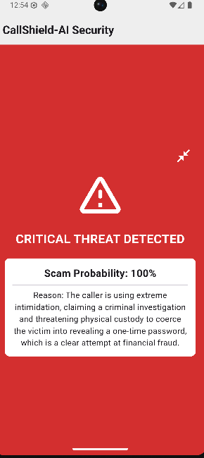
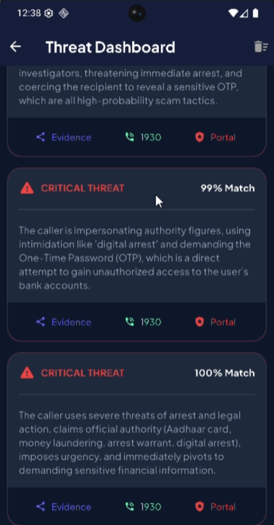
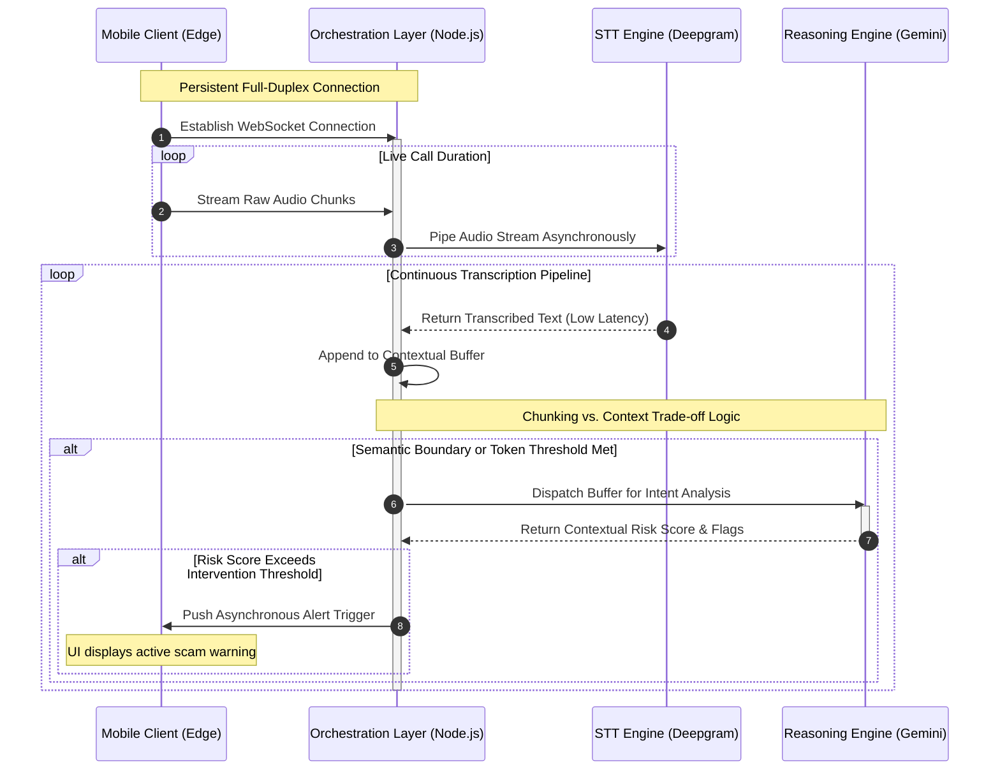

# CallShield-AI: A Real-time LLM-driven Pipeline for Social Engineering Detection

### Abstract
Social engineering attacks via telephonic channels have grown increasingly sophisticated, exploiting human vulnerabilities rather than technical system flaws. Current defensive paradigms rely heavily on static blacklists and post-incident reporting, creating a critical "Detection Gap" for zero-day scam campaigns and dynamic impersonation tactics during live audio streams. CallShield-AI proposes a real-time, context-aware intervention system that evaluates conversational semantics mid-flight. By orchestrating a low-latency speech-to-text pipeline with advanced Large Language Model reasoning, this system detects psychological manipulation tactics and fraudulent intent, bridging the gap between static defense and active threat neutralization.

---

### Current Implementation Status (MVP)
The current version is a functional prototype utilizing Node.js for orchestration, Deepgram for high-speed STT, and the Gemini 1.5 Flash API for reasoning. It successfully demonstrates the end-to-end pipeline from audio ingestion to active scam notification, proving the viability of mid-call latency constraints.

---

### Demo & UI

*Figure 2: Real-time alert triggered when the system detects a 'Sense of Urgency' combined with a 'Financial Request'.*

 

*Figure 3: Mobile interface of the Threat Dashboard displaying high-confidence alerts (99%+ match) generated by the reasoning engine in response to severe coercion and OTP requests.*

### System Architecture

The system is designed as a decoupled, distributed processing pipeline to isolate the client-side audio capture from the computationally intensive inference layer. 

* **Asynchronous Processing:** Audio streams from the telecommunication layer are ingested asynchronously via persistent WebSocket connections. This prevents blocking operations and maintains the full-duplex communication required for live phone calls.
* **STT-to-LLM Orchestration:** Continuous audio streams are piped directly into a high-speed Speech-to-Text (STT) engine. The orchestration layer manages state, buffering the transcribed text into discrete, overlapping chunks before dynamically routing them to the reasoning engine.
* **Contextual Inference:** The Gemini API serves as the core reasoning engine. Instead of relying on rigid keyword matching, it performs semantic evaluation on the dialogue's trajectory, maintaining conversational context to accurately identify sophisticated multi-stage manipulation techniques.

---

### Key Engineering Challenges

| Challenge | Implication | Architectural Mitigation |
| :--- | :--- | :--- |
| **End-to-End Latency** | Sequential processing of audio, transcription, and inference creates a "latency bottleneck," rendering mid-call intervention impossible. | Implementation of a concurrent pipelining strategy. The STT engine feeds a buffer that the LLM analyzes asynchronously, prioritizing chunked context over full-sentence completion. |
| **Context vs. Overhead** | Sending every transcribed word to the LLM exhausts API quotas and token limits; waiting for long pauses risks missing the intervention window. | Dynamic token-window logic that triggers intent analysis cycles based on semantic boundary markers rather than strict time intervals. |
| **Accuracy Trade-offs** | Aggressive filtering yields False Positives (interrupting safe calls); passive filtering yields False Negatives (allowing scams to proceed). | Tunable heuristic thresholding, prioritizing the mitigation of False Negatives while utilizing a multi-tiered alerting system for the end-user. |

---

### Methodology: Heuristic Logic & Scam Indicators
The detection mechanism moves beyond static filtering by employing heuristic logic mapped to established social engineering frameworks. The reasoning engine continuously evaluates the conversational transcript against a matrix of psychological triggers:

* **Artificial Urgency & Coercion:** Detecting semantic patterns designed to bypass logical reasoning, such as artificial time constraints, threats of legal action, or account suspension warnings.
* **Financial & Data Requests:** Flagging unwarranted transitions toward the extraction of sensitive information (e.g., OTPs, bank routing numbers) or immediate financial transfers.
* **Authority Impersonation:** Analyzing the dialogue for contextual inconsistencies common when callers attempt to masquerade as government officials, bank representatives, or technical support.

---

### Evaluation Strategy: 
To rigorously validate the pipeline's detection capabilities and latency constraints, the system was benchmarked against varied simulated scam taxonomies. 

| Scenario | Success Rate | Avg. Detection Latency |
| :--- | :--- | :--- |
| **Banking/KYC Scam** | 100% (5/5) | 2.3 Seconds |
| **Lottery/Prize Scam** | 80% (4/5) | 3.1 Seconds |
| **Normal/Benign Call** | 100% (5/5) | N/A (No False Alarms) |

---

### Future Research Directions
1.  **On-device tinyML Inference:** Transitioning the initial classification layer to edge devices to drastically reduce latency and preserve user privacy by minimizing cloud reliance for benign calls.
2.  **Multi-lingual Support for Regional Dialects:** Expanding the STT and LLM pipelines to natively process code-mixed languages and regional dialects (e.g., Hindi-English) critical for deployment in the Indian telecommunications landscape.
3.  **Acoustic Feature Integration:** Augmenting the semantic text analysis with parallel acoustic evaluation to detect vocal stress, synthetic voice generation (deepfakes), and abnormal cadences.